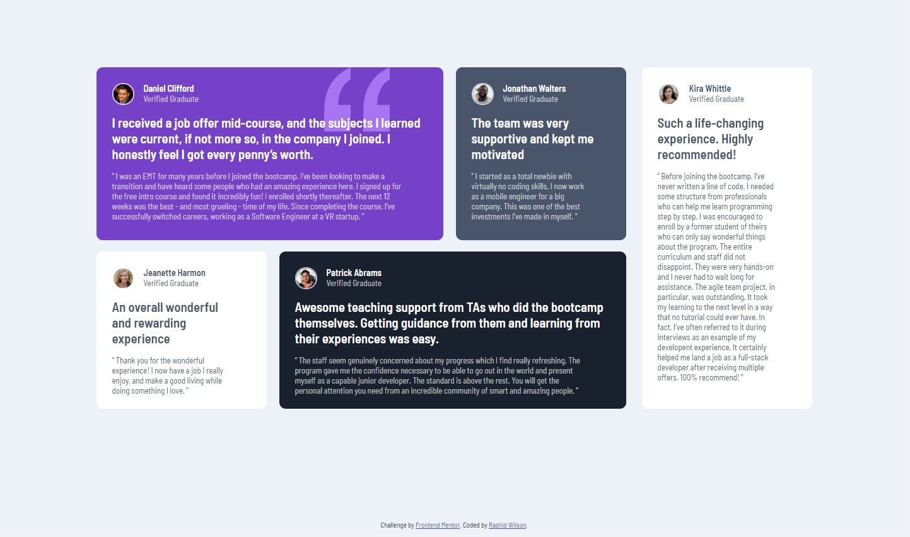

# Frontend Mentor - Testimonials grid section solution

This is a solution to the [Testimonials grid section challenge on Frontend Mentor](https://www.frontendmentor.io/challenges/testimonials-grid-section-Nnw6J7Un7). Frontend Mentor challenges help you improve your coding skills by building realistic projects. 

## Table of contents

- [Overview](#overview)
  - [The challenge](#the-challenge)
  - [Screenshot](#screenshot)
  - [Links](#links)
- [My process](#my-process)
  - [Built with](#built-with)
  - [What I learned](#what-i-learned)
  - [Continued development](#continued-development)
  - [Useful resources](#useful-resources)
- [Author](#author)
- [Acknowledgments](#acknowledgments)

## Overview

### The challenge

Users should be able to:

- View the optimal layout for the site depending on their device's screen size

### Screenshot

### Links

- Live Site URL: [Hosted on Github Pages](#)

## My process

### Built with

- HTML
- Sass/Css
- CSS Grid
- Mobile-first workflow

### What I learned

This was my first time using CSS Grid. As for what I learned from this project, two main concepts stick out in my head. The first being the creation of grids using the "grid-template-area" css rule which allowed me to visually create a template and map out where each cell's content would appear. The second being the "grid-template-rows" and "grid-template-columns" css rules which allowed me to define the size of the columns and rows respectively.

### Continued development

For future projects that require grids my aim is to utilize more of the CSS Grid features. One that comes to mind is the use of the "repeat()" function in conjunction with the "fr" units. I imagine it would prove useful in situations where you are loading dynamic content from an api and are looking for more of a generic CSS Grid template loading X cells ( where X is greater than one and hopefully less than infinity lol).

### Useful resources

- [My Intro to CSS Grid](https://www.freecodecamp.org/news/css-grid-tutorial-with-cheatsheet/) - This tutorial was my introduction to CSS Grid. Initially I followed along with the tutorial using CodePen.io to get some of the basic concepts down. Throughout my design process I also used it as a reference.
- [Lining up the Background Quotation Marks](https://css-tricks.com/positioning-offset-background-images/) - I still haven't built up the intuition for positioning background images. I used this as a reference and it helped me achieve the position of the quotation mark background image.

## Author

- Website - [Rashid Wilson](#)
- Frontend Mentor - [@shangum](https://www.frontendmentor.io/profile/shangum)

## Acknowledgments

Shout out to [Joy Shaheb](https://www.freecodecamp.org/news/author/joy/) from [FreeCodeCamp.org](https://www.freecodecamp.org/) for the great CSS Grid introduction tutorial. It really helped!
